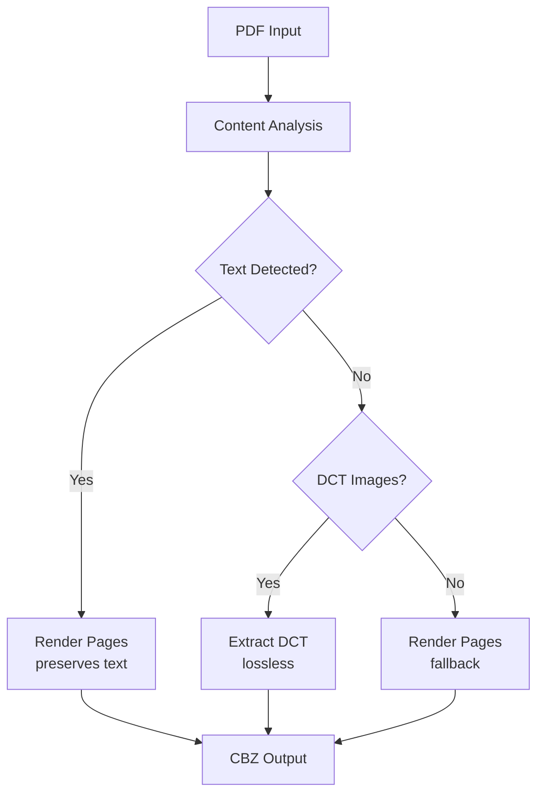

# CBZify 📚➡️📦

> **Convert PDF & EPUB comics to CBZ format with intelligent text preservation**

CBZify is a powerful comic conversion tool that converts EPUB and PDF files to CBZ (Comic Book Zip) format. It features smart PDF analysis to preserve text overlays, multi-threaded processing, and both CLI and web interfaces.

[](https://github.com/users/skgchp/packages/container/package/cbzify)
[](https://python.org)
[](LICENSE)

## ✨ Key Features

- 🧠 **Smart PDF Analysis**: Detects text overlays and chooses optimal conversion method
- 🌐 **Web Interface**: Modern, accessible web UI with real-time progress
- 🐳 **Docker Ready**: Production-grade containers with security hardening
- ⚡ **Multi-threaded**: Configurable worker threads for optimal performance
- 🎛️ **Flexible Output**: Multiple image formats (PNG, JPEG, WebP) with quality control
- 🔒 **Secure**: Rootless execution with minimal attack surface

## 🚀 Quick Start

### Web Interface (Recommended)

```bash
# Using Docker (easiest)
docker run -p 8080:8080 ghcr.io/skgchp/cbzify:latest

# Access at http://localhost:8080
```

Simply drag and drop your PDF or EPUB files, adjust settings, and download your CBZ files!

### Command Line Interface (Recommended for batch processing)

```bash
# Install dependencies
pip install -r requirements.txt

# Single file conversion
python src/comic_converter.py comic.pdf comic.cbz

# Bulk directory processing
python src/comic_converter.py input_dir/ output_dir/

# High-quality JPEG output
python src/comic_converter.py --dpi 450 --format jpg --quality 98 comic.pdf comic.cbz
```

## 🎛️ Configuration Options

### CLI Parameters

| Option | Default | Description |
|--------|---------|-------------|
| `--workers` | 4 | Number of parallel threads (CLI: 1-16, Web: 1-6) |
| `--dpi` | 300 | Output resolution (50-600) |
| `--format` | png | Image format (png/jpg/webp) |
| `--quality` | 95 | JPEG/WebP quality (1-100) |
| `--skip-checks` | - | Skip content analysis (consistent performance) |
| `--skip-existing` | - | Skip existing files (bulk mode) |

### Web Interface Features

- 🎨 **Drag & Drop Upload**: Support for files up to 2GB
- ⚙️ **Real-time Settings**: Adjust DPI, format, and quality
- 📊 **Live Progress**: WebSocket-based progress tracking
- 📱 **Mobile Friendly**: Responsive design for all devices
- ♿ **Accessible**: Accessible design

## 🧠 How It Works

### Smart PDF Processing

CBZify analyzes PDF structure to choose the optimal conversion method:



**Why This Matters**: Many comics have text as vector overlays separate from background images. Extracting only images would lose speech bubbles and captions. CBZify detects this and preserves all content.

### Performance Optimization

#### Hardware Recommendations
- **CLI - 4-8 cores**: `--workers 6-8`
- **CLI - 8+ cores**: `--workers 12-16` 
- **CLI - Apple Silicon**: `--workers 8-12`
- **Container/Web - Any system**: Max 6 workers (auto-scaled by memory)
- **Limited RAM**: `--workers 2-4`

#### Processing Modes
- **Smart Mode** (default): Analyzes each PDF for optimal method
- **Skip Analysis** (`--skip-checks`): Skips content analysis, always renders pages (consistent performance)

## 🐳 Docker Deployment

### Production Deployment

```bash
# Simple deployment
docker run -d \
  --name cbzify \
  --restart unless-stopped \
  -p 8080:8080 \
  ghcr.io/skgchp/cbzify:latest

# With persistent storage
docker run -d \
  --name cbzify \
  --restart unless-stopped \
  --security-opt no-new-privileges:true \
  -p 8080:8080 \
  -v cbzify-data:/app/uploads \
  ghcr.io/skgchp/cbzify:latest
```

### Docker Compose

Use the provided `docker/docker-compose.yml` file or create your own:

```yaml
services:
  cbzify:
    image: ghcr.io/skgchp/cbzify:latest
    container_name: cbzify
    restart: unless-stopped
    ports:
      - "8080:8080"
    volumes:
      - cbzify-uploads:/app/uploads
      - cbzify-downloads:/app/downloads
    environment:
      - PYTHONUNBUFFERED=1
    security_opt:
      - no-new-privileges:true
    healthcheck:
      test: ["CMD", "/usr/local/bin/python3", "-c", "import urllib.request; urllib.request.urlopen('http://localhost:8080/status')"]
      interval: 30s
      timeout: 10s
      retries: 3
      start_period: 30s

volumes:
  cbzify-uploads:
  cbzify-downloads:
```

Then run:
```bash
# From the docker directory
cd docker && docker-compose up -d

# Or specify the file path
docker-compose -f docker/docker-compose.yml up -d
```

### Production Features
- 🔒 **Security Hardened**: Distroless container with non-root execution (UID 65532)
- 🏗️ **Minimal Attack Surface**: Based on Google's distroless images
- 📊 **Multi-arch**: AMD64 and ARM64 support
- 🔍 **Health Checks**: Built-in monitoring and auto-recovery
- 🛡️ **Vulnerability Scanned**: Automated security scanning
- ⚡ **Container-Safe**: Intelligent worker scaling prevents memory issues

## 📊 Performance Benchmarks

| Content Type | Method | Speed | Quality |
|-------------|--------|-------|---------|
| Image-only PDF | DCT Extract | 5-50 pages/sec | Lossless |
| Text-overlay PDF | Page Render | 0.5-5 pages/sec | High |
| EPUB Images | Direct Extract | 2-20 images/sec | Original (preserves dimensions) |

*Results vary by hardware and content complexity*

## 🎨 Output Examples

### CLI Output
```bash
$ python src/comic_converter.py comic.pdf comic.cbz

CBZify v1.0
--------------------------------------------------
Detected file type: PDF
PDF opened successfully - 25 pages detected
Analyzing PDF content structure...
  - DCT images: 5/5
  - Text content: No
PDF classification: DCT-based (safe for direct extraction)
Extracted 25 DCT images from PDF
Successfully created CBZ: comic.cbz (45.2 MB)
Conversion completed successfully!

# With skip-checks mode:
$ python src/comic_converter.py --skip-checks comic.pdf comic.cbz

CBZify v1.0
--------------------------------------------------
Skip checks: Enabled (skipping content analysis)
Detected file type: PDF
PDF opened successfully - 25 pages detected
Skip checks: Skipping content analysis - rendering all pages
Rendered 25 pages from PDF
Successfully created CBZ: comic.cbz (52.1 MB)
Conversion completed successfully!
```

## 🛠️ Troubleshooting

### Common Issues

**Missing Dependencies**
```bash
pip install PyMuPDF EbookLib Pillow
```

**Slow Processing**
- Adjust `--workers` based on your hardware
- Check available RAM and disk space

**Docker Issues**
```bash
# Check container logs
docker logs cbzify

# Verify health
curl http://localhost:8080/status

# Restart with fresh image
docker pull ghcr.io/skgchp/cbzify:latest && docker restart cbzify
```

### Performance Optimization
- **SSD Storage**: Significant speed improvement
- **More RAM**: Allow higher worker counts  
- **Modern CPU**: Better multi-threading performance
- **Fast Network**: For web interface file uploads

## 📄 License

This project is licensed under the GNU Affero General Public License v3.0 - see the [LICENSE](LICENSE) file for details.

## 🙏 Acknowledgments

- **PyMuPDF**: Excellent PDF processing library
- **EbookLib**: EPUB handling capabilities  
- **Flask**: Web framework for the interface
- **Bootstrap**: UI components and accessibility

---

**Made with ❤️ for the comic community**

Convert your digital comics with confidence - CBZify preserves every speech bubble, every caption, and every detail.

---

## 🔧 For Developers

This is a personal project, it is unlikely to be regularly maintained. If you want to fork it check out [DEVELOPERS.md](DEVELOPERS.md) for:
- Development setup and environment
- Architecture and code structure
- Testing and CI/CD workflows
- API documentation